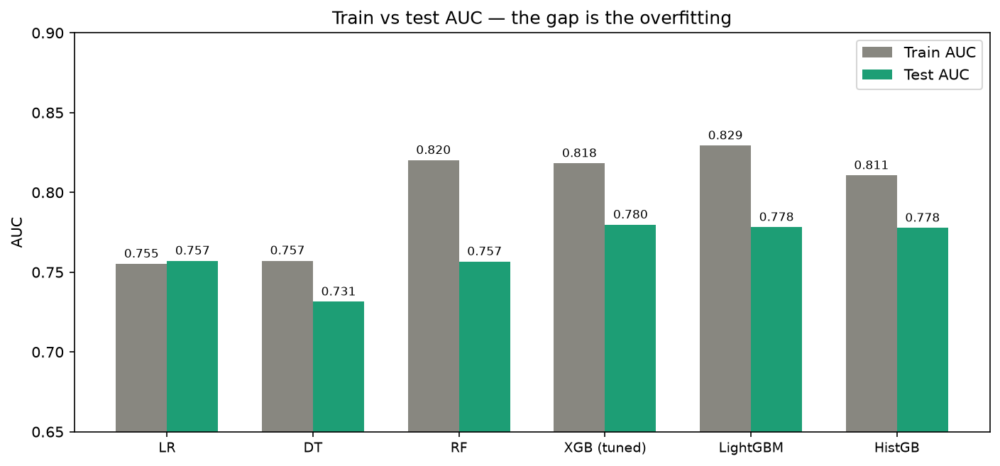
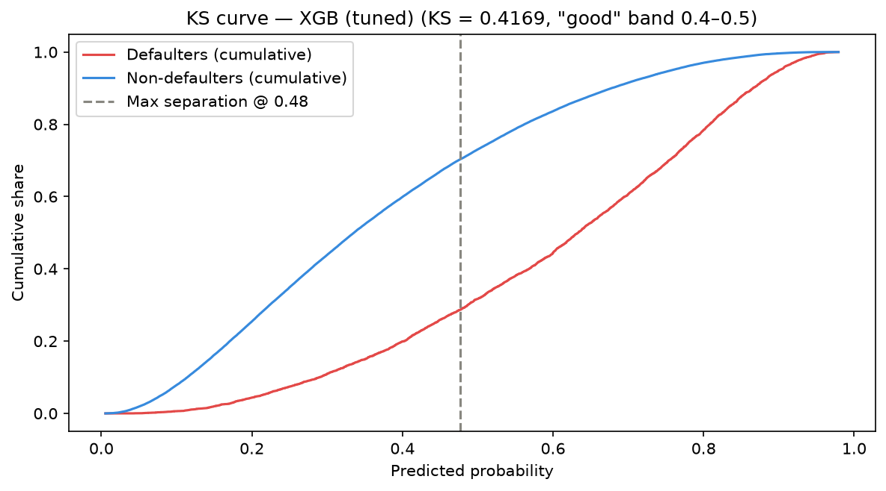
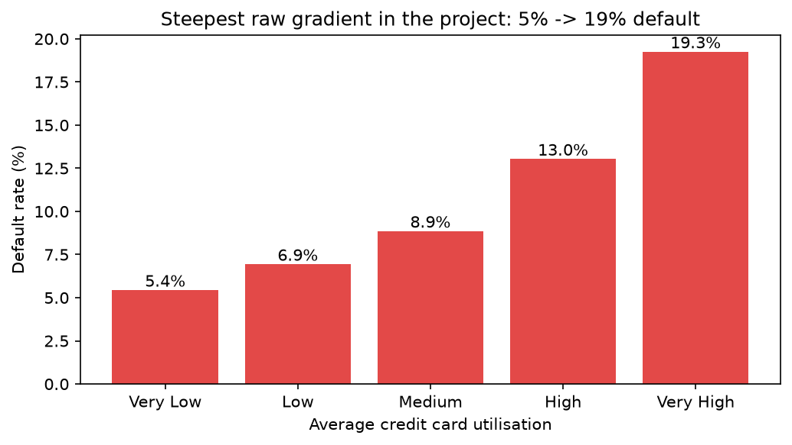
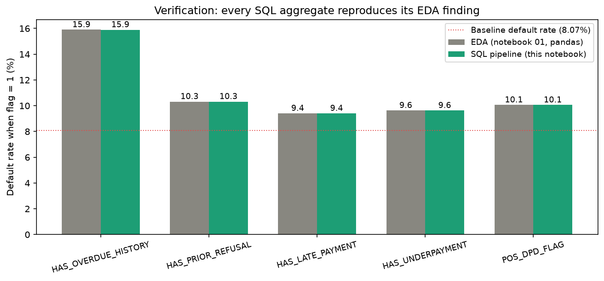
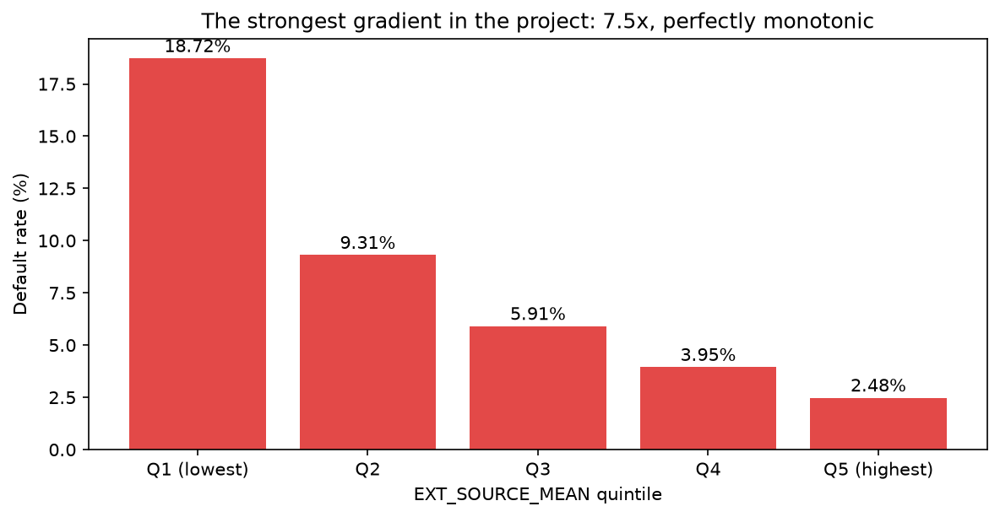
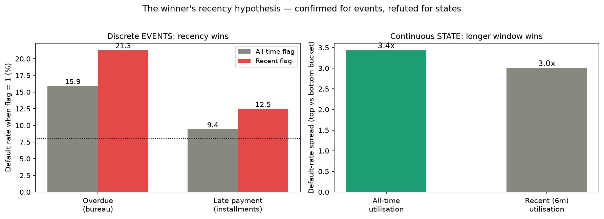
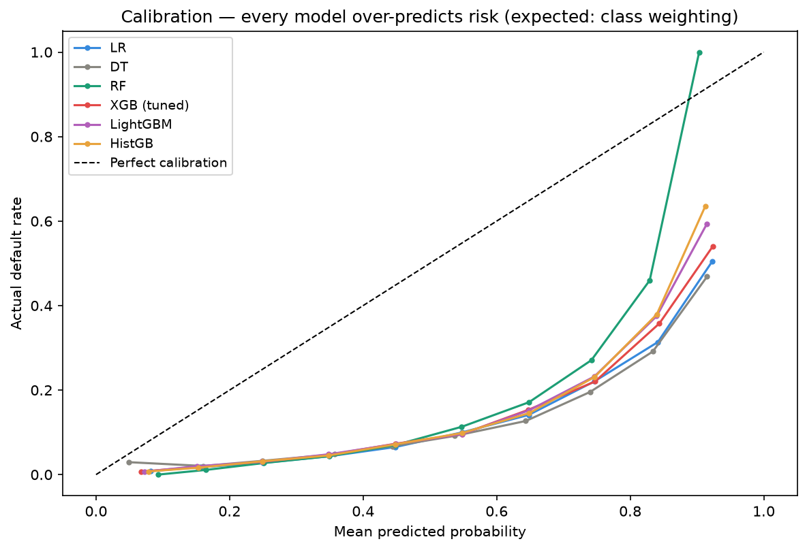
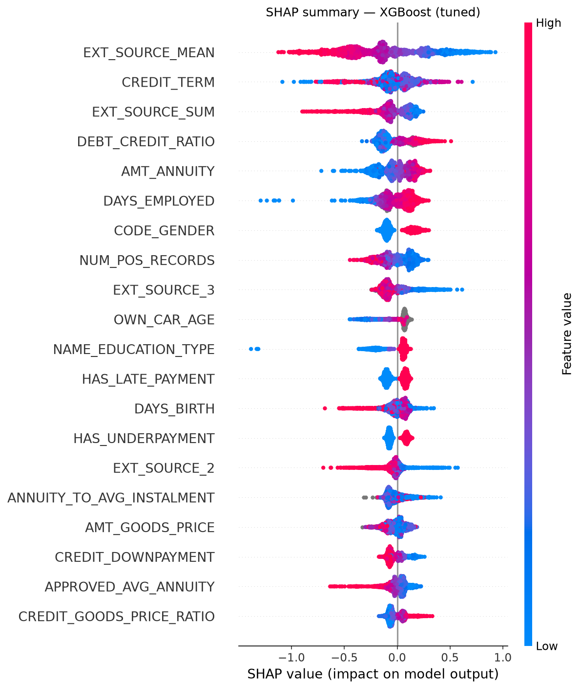

# Credit Risk Modelling — Probability of Default Scorecard

A complete, evidence-driven probability-of-default pipeline built on the [Home Credit Default Risk](https://www.kaggle.com/c/home-credit-default-risk) Kaggle dataset (307,511 applications, 7 relational tables), developed as part of an MSc Data Science project at CMI.

**Resume line:** Credit Risk Modelling — PD Scorecard | SQL (CTEs, window functions), IV feature selection, XGBoost/LightGBM, SHAP

Every step was driven by direct inspection of the data rather than assumption. Ideas borrowed from public solutions (including the 2018 winner's writeup) were re-verified against this project's own data before being trusted — including the cases where they did **not** hold.

---

## Headline results (held-out 20% test set, leakage-free)

| Model | Test AUC | Test KS (primary) | Gini | Brier | Train−test gap |
|---|---|---|---|---|---|
| **XGBoost (Optuna-tuned, CV)** | **0.7797** | **0.4169** | **0.560** | **0.18** | 0.04 |
| LightGBM | 0.7781 | 0.42 | 0.56 | 0.18 | 0.05 |
| HistGradientBoosting | 0.7777 | 0.41 | 0.56 | 0.18 | 0.03 |
| Logistic Regression | 0.7571 | 0.39 | 0.51 | 0.20 | −0.00 |
| Random Forest | 0.7566 | 0.39 | 0.51 | 0.19 | 0.06 |
| Decision Tree | 0.7314 | 0.35 | 0.46 | 0.20 | 0.03 |

Three independent boosting libraries land within 0.002 AUC of each other — library-independent evidence that gradient boosting fits this data. KS 0.4169 sits in the industry "good" band (0.4–0.5). Logistic Regression stays the interpretable, scorecard-ready baseline with essentially zero overfitting; Random Forest overfits most.




---

## Methodology upgrades in v2 (found, fixed, and measured)

This repository is the second iteration. Three genuine flaws in v1 were found during review, fixed, and their cost measured:

1. **Hyperparameter tuning leaked the test set.** v1's Optuna objective scored trials on the test set. v2 tunes with 3-fold stratified CV on training data only (seeded sampler), refits on full train, and touches the test set once. Measured cost of honesty: AUC 0.7802 → **0.7797**.
2. **Feature selection used test-set labels.** v1 computed IV/correlation/MI/VIF on all rows. v2 freezes the 80/20 split *first* (`train_test_split_ids.csv`), computes every selection statistic on training rows only, and every later notebook loads the same frozen split. The selected sets (45 general / 41 LR) were unchanged — but now provably clean.
3. **Explanations could silently mismatch training.** v1's SHAP notebook refit fresh label encoders on full data. v2 saves the training-fit encoders/imputer in notebook 05 and reuses them everywhere downstream.

Two smaller consistency fixes: the SQL pipeline now averages the *already-cleaned* utilisation column from the EDA checkpoint (single source of cleaning truth), and a cross-notebook variable dependency in notebook 03 (would crash any fresh run) was removed.

---

## Project structure

```
credit_risk_pd_scorecard/
    utils.py                     shared constants + plotting helpers (all notebooks import it)
    data/home_credit_data/       raw CSVs, cleaned checkpoints, SQLite db, frozen split ids
    notebooks/
        01_eda_and_data_cleaning.ipynb    Stage 2 — EDA of all 7 tables + cleaned checkpoints
        02_sql_pipeline.ipynb             Stage 1 — SQL aggregation (CTEs, window functions)
        03_feature_engineering.ipynb      Stage 4 — 17 engineered features in 4 batches
        04_feature_selection.ipynb        Stage 5 — split-first IV / corr / MI / VIF (train-only)
        05_model_training.ipynb           Stages 6+8 — 6 model pipelines, CV-based Optuna tuning
        06_evaluation.ipynb               Stage 9 — KS, AUC/Gini, calibration, gain, overfit check
        07_explainability_shap.ipynb      Stage 10 — coefficients, tree diagram, SHAP ×3 models
    outputs/
        figures/                 all charts referenced below
        models/                  fitted models + saved encoders/imputer (.pkl)
    README.md
```

## Dataset

Seven tables joined around `SK_ID_CURR`: `application_train` (anchor, contains `TARGET`, 8.07% default rate), `bureau` + `bureau_balance` (external credit history), `previous_application`, `installments_payments`, `credit_card_balance`, `POS_CASH_balance`. `bureau_balance` (27.3M rows) was deliberately excluded after EDA showed weak signal relative to its size.

## Pipeline highlights

**1 — EDA (nb 01).** Found and fixed the `DAYS_EMPLOYED` sentinel (365243 = unemployed, 18% of rows — flag created *before* replacement), a 247× income data-entry outlier (winsorised, flagged), informative missingness (`OCCUPATION_TYPE`, building columns → one flag), and 14 ranked candidate features. Strongest raw signal: average credit-card utilisation, a monotonic 5% → 19% default gradient.



**2 — SQL pipeline (nb 02).** Five `GROUP BY` aggregations (aggregate function chosen per EDA evidence: MAX for rare events, MEAN for continuous behaviour, conditional `CASE WHEN` for the Approved/Refused structural split), composed into a single CTE query with `LEFT JOIN` + `COALESCE`; a window-function (`ROW_NUMBER`) recency profile; hard assertions on rows/columns/keys. Every aggregate re-verified against its EDA default rate:



**3 — Feature engineering (nb 03).** 17 features in 4 batches. `EXT_SOURCE_MEAN` emerged as the project's strongest feature (corr −0.222; 18.7% → 2.5% across quintiles, 7.5×, perfectly monotonic). The winner's recency hypothesis was tested three times and **refined**: recency wins for discrete events (recent overdue: 21.3% vs all-time 15.9%) but loses for continuous states (recent utilisation weaker than all-time). Three community-favourite ratios failed honestly and were documented as negatives.




**4 — Feature selection (nb 04).** Split-first, then train-only layered filtering: IV (<0.02 dropped, with two evidence-protected exceptions where the metric — not the feature — was at fault), correlation (>0.85, keep higher IV), MI cross-check, VIF (EXT family reduced to `EXT_SOURCE_MEAN` for the LR set). Includes a real found-and-fixed bug: a pandas `str`-vs-`object` dtype check silently failing all categorical IVs, caught because the "failures" contradicted EDA evidence.

**5 — Models (nb 05).** Six models, six pipelines (imputation/scaling/encoding per model class; sklearn's silent native NaN handling in trees was detected and replaced with explicit imputation for reproducibility). Imbalance via class weights / `scale_pos_weight` — no SMOTE. XGBoost tuned by seeded Optuna with CV-only objective.

**6 — Evaluation (nb 06).** KS primary, plus AUC/Gini, recall, calibration + Brier, cumulative gain (top decile catches ~37% of defaulters, 3.7× random), and the train-vs-test gap check. Honest limitation documented: all six models are systematically miscalibrated (expected side effect of class weighting — fine for ranking/cutoffs, requires isotonic/Platt recalibration before any PD-as-probability use).



**7 — Explainability (nb 07).** LR coefficients (with odds ratios), the whiteboard tree diagram, SHAP for XGBoost, Random Forest and LightGBM (using the saved training encoders), a per-customer SHAP waterfall ("reason codes" prototype), and a dependence plot showing the star feature's effect is linear and age-independent. **Five independent methods — correlation, IV, the tree's root split, LR coefficients, SHAP — all rank `EXT_SOURCE_MEAN` #1.** One fairness consideration flagged explicitly: `CODE_GENDER` appears in top SHAP features and would require fair-lending review in any regulated deployment.



## Key decisions & honest limitations

- **Random stratified split, not time-based** — `application_train` has no time column (`DAYS_DECISION` belongs to past applications); out-of-time validation would be mandatory in production, and PSI simulation was skipped for the same root cause.
- **Only XGBoost tuned** — the untuned boosters already clustered within 0.002 AUC (performance is feature-limited, not tuning-limited); tuning gained +0.003, confirming a well-chosen baseline.
- **Scorecard conversion (Stage 11)** deliberately scoped out; the validated LR coefficients it would be built from are produced in notebook 07.
- **Miscalibration** found and diagnosed, recalibration named as the concrete pre-production step.

## Stack

Python, pandas, scikit-learn, XGBoost, LightGBM, SHAP, optbinning (IV), Optuna, SQLite, matplotlib/seaborn.

## Reproducing

1. Download the [dataset](https://www.kaggle.com/c/home-credit-default-risk/data) into `data/home_credit_data/`.
2. Keep `utils.py` in the project root; start Jupyter from the project root.
3. `pip install optbinning statsmodels lightgbm xgboost optuna shap`
4. Run notebooks 01 → 07 in order (`Restart & Run All` each); each writes checkpoints the next consumes. The Optuna cell in 05 is the slow one (30 trials × 3-fold CV).
